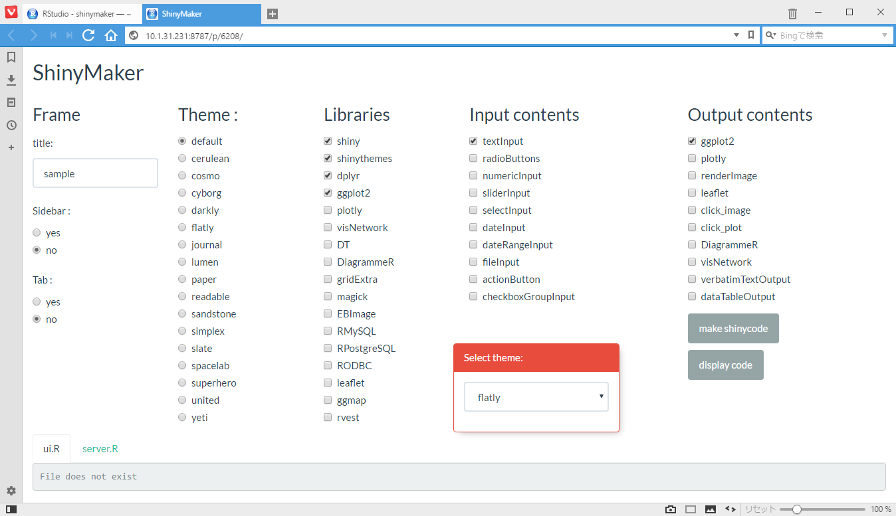
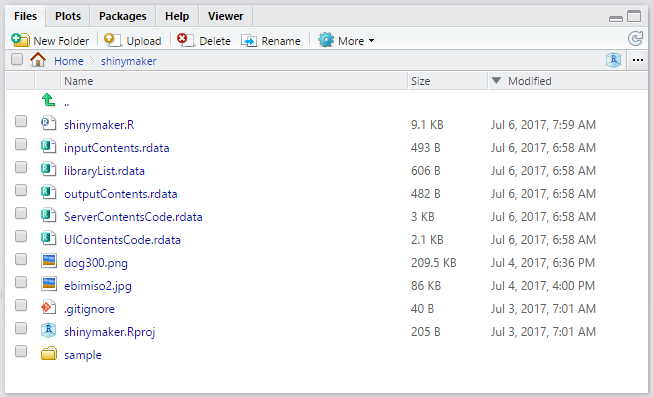
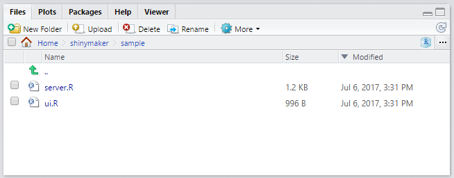
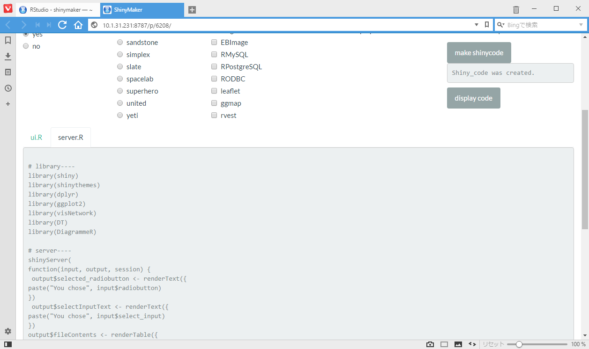
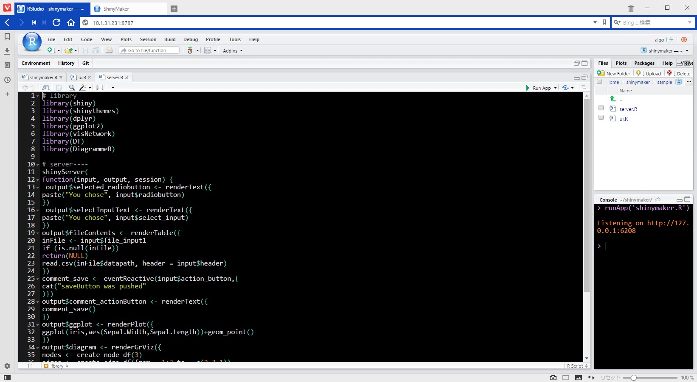
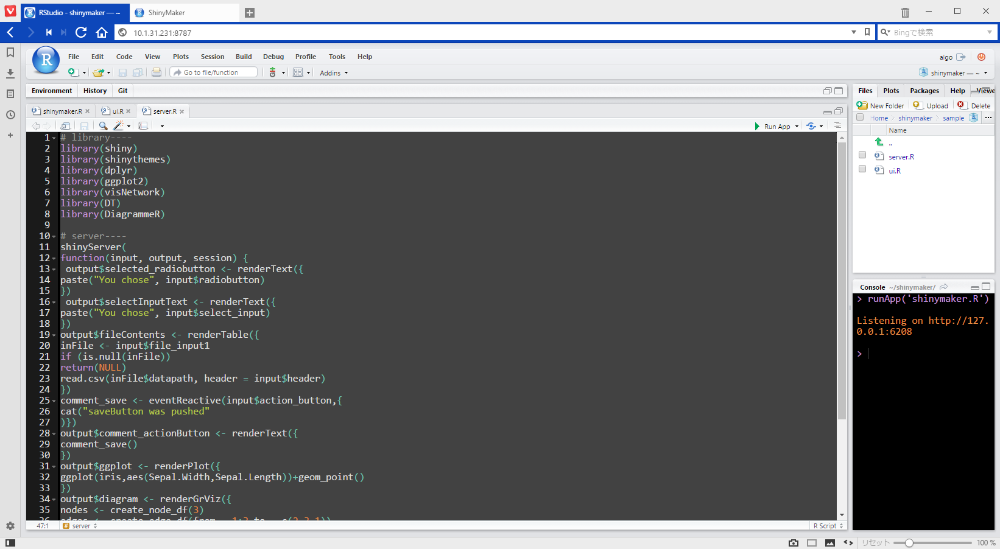
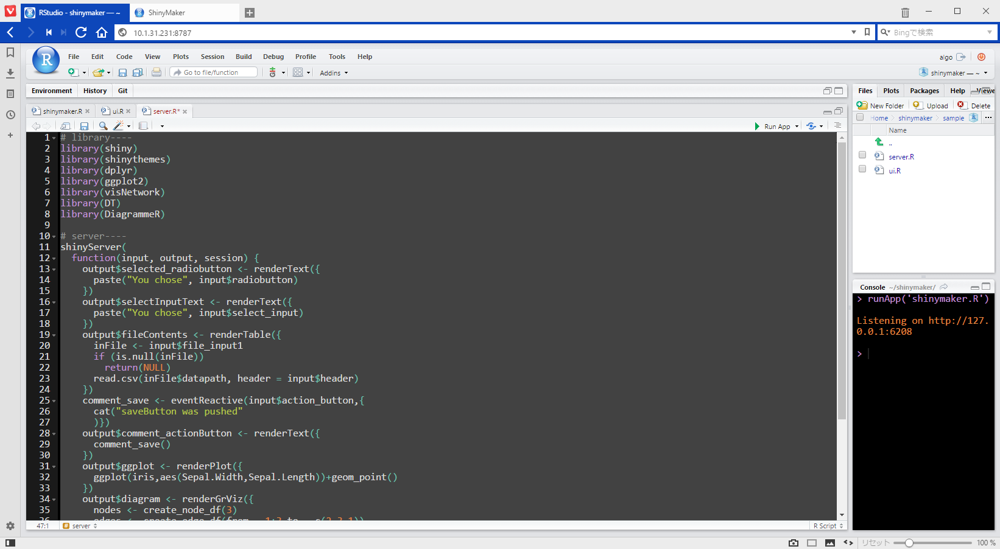
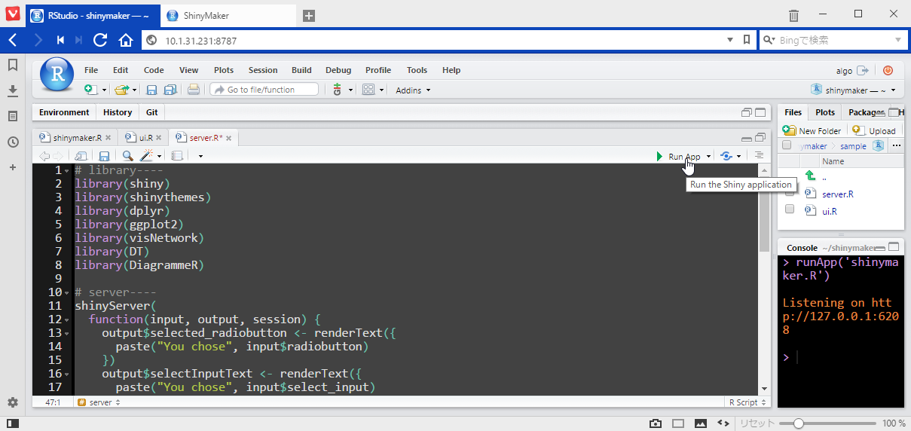
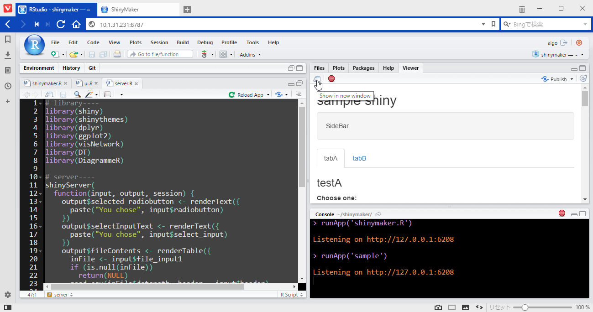
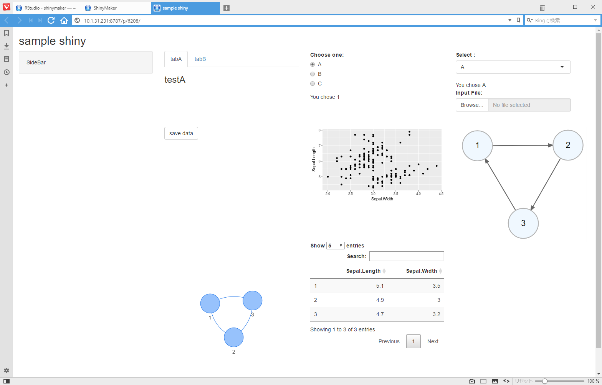

# shinymakeraddin

このパッケージは[\@R_beginnerさん](https://twitter.com/R_beginner)の[shinymaker](https://github.com/Algo1970/shinymaker)をRStudio Addinから実行できるようにパッケージにしたものです。

```
devtools::install_github("pontsuyu/shinymakeraddin")
```
RStudio上部のAddinsから**shiny Template Maker**を選択して使用してください。

### 概要 

- shinyアプリの雛形ファイルを作成するためのshinyアプリです。

### 使用法 


1. 必要があればtitile名を入力し、Sidebar、Tabの有無にチェックを付けて下さい。

2. Select themeウインドウで使用するテーマを確認し、Themeにチェックを入れます。

3. 次に使用したいlibraryをチェックします。

4. Input contentsには、私がよく使用するInputUIのみ入っています。

5. Output contentsから使用したい内容を選択して下さい。

コードを簡単にするため（面倒だったから？）、libraryとOutput contentsの内容とはリンクしておりません。

6. shinyコードを作成します。右下のmake shinyボタンを押して下さい。ワーキングディレクトリにshinyアプリ(ui.r/server.r)の入ったフォルダが作成されます。



フォルダの中にui.Rとserver.Rファイルが作成されています。



7. どのようなコードが作成されたか確認してみましょう。display codeボタンを押すと、タブ内にコードが表示されます。




作成されたコードはインデントが調整されておりませんので、Rstudioのショートカット(ctrl+A  →　ctrl+I)でインデントを付けて、コードの修正等行うと良いと思います。



- Ctrl + A



- Ctrl + I




8. 作成されたshinyアプリを実行してみましょう。




RunAppボタンを押して実行します。




Viewer内に表示されたら、Show in New Windowボタンを押してください。

Webブラウザで立ち上がりました。
これができあがったshinyアプリです。




shinyアプリのパーツが並んでいるので、コードを少し変更するだけでアプリを仕上げることができます。　　
アプリ作成時間が、かなり短縮できると思いますので試してみて下さい。


